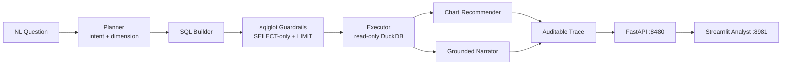

# CopilotDesk — Multi-Agent Analytics Copilot

<div align="center">

[](https://www.python.org/)
[](https://fastapi.tiangolo.com/)
[](https://streamlit.io/)
[](https://mlflow.org/)
[](https://www.docker.com/)
[](https://github.com/astral-sh/ruff)
[](https://pytest.org/)
[](https://opensource.org/licenses/MIT)

</div>

> **A natural-language question becomes a governed answer: a planner routes intent, a SQL builder composes a query over a DuckDB star schema behind sqlglot AST guardrails, an executor runs it read-only, a chart agent picks the visual, and a narrator writes a grounded takeaway — every stage captured in an auditable trace.**

---

## 📖 Executive Summary & Value Proposition

**`copilotdesk`** is a production-grade, end-to-end machine learning system built with strict engineering discipline, reproducible pipelines, and enterprise MLOps best practices. It bridges the gap between theoretical statistical rigor and high-availability operational microservices.

## 📊 Core Methodologies & Agent Orchestration

### 1. Five Cooperating Agents, One Trace
`plan → build SQL → guard → execute → chart → narrate`. Each agent's output is appended to a trace, so the final answer is fully auditable — you can see exactly which SQL produced which number and why a line chart was chosen.

### 2. Governed SQL, Not Hope
- The SQL builder emits parameter-free queries from a typed plan; **sqlglot AST guardrails** enforce single-statement, SELECT-only, no DDL/DML, and inject a row LIMIT before anything reaches the database. Execution is on a **read-only** DuckDB connection.
- Guardrail pass rate 100%; write/multi-statement attempts (DROP, DELETE, UPDATE, `SELECT 1; SELECT 2`) are all rejected — verified in tests.

### 3. Measured, Not Vibes (labeled question set)

| Metric (12 labeled questions over 12k orders) | Value |
|---|---|
| Planner intent accuracy (kpi / breakdown / trend / top-n) | **91.7%** |
| Guardrail pass rate | 100% |
| Execution rate | 100% |

### 4. Chart Recommendation & Grounded Narrative
- Intent → chart type (trend→line, breakdown/top-n→bar, kpi→metric); the narrator's sentence is computed from the returned rows ("**electronics** leads on revenue, 24% of total"), never invented.

## 📊 Architecture & Pipeline



## 🛠️ Tech Stack & Engineering Standards
- **Core Engine:** Python 3.12, DuckDB, sqlglot, Pandas
- **Serving & UI:** FastAPI, Streamlit + Plotly, MLflow
- **Testing:** Pytest verification of intent routing, guardrail blocks + LIMIT injection, per-intent SQL shapes, end-to-end answers with exact trace length, and eval metrics


---

## 🚀 Quickstart & Setup Guide

### 1. Prerequisites & Environment Setup
Using **[uv](https://docs.astral.sh/uv/)** for lightning-fast, reproducible dependency resolution:

```bash
# Clone the repository
git clone https://github.com/jackson-marcus/copilotdesk.git
cd copilotdesk

# Install dependencies and pre-commit hooks
uv sync --group dev
```

### 2. Build the Warehouse & Evaluate
```bash
# Create the DuckDB star schema + labeled question set
uv run python scripts/make_warehouse.py

# Run the analyst over the question set; logs routing + guardrail metrics to MLflow
uv run python -m copilotdesk.agents.evaluate
```

### 3. Run Test Suite & Code Quality Checks
```bash
# Run unit & integration tests with coverage
uv run pytest --cov

# Run ruff linter and formatting checks
uv run ruff check .
uv run ruff format --check .
```

### 4. Launch Services Locally
```bash
# Start FastAPI REST API (listening on port :8480)
make api
# Or: uv run uvicorn copilotdesk.api.main:app --reload --port 8480

# Start interactive Streamlit dashboard (listening on port :8981)
make ui

# Launch local MLflow Experiment Tracking UI (listening on port :5049)
make mlflow
```

### 5. Run with Docker Compose
```bash
# Spin up the complete microservice stack
docker compose up --build
```

---

## 📂 Repository Layout

```
copilotdesk/
├── .github/workflows/ci.yml       # GitHub Actions CI pipeline (lint, test, build)
├── configs/                      # Warehouse and agent configuration
├── data/                         # DuckDB warehouse + question set + eval report
├── scripts/                      # make_warehouse.py star-schema + question generator
├── src/copilotdesk/              # Core Python package
│   ├── agents/                   # planner, sqlbuilder+guardrails, pipeline, evaluate
│   ├── api/                      # FastAPI routes: /ask /schema /report
│   ├── ui/                       # Streamlit analyst application
│   └── settings.py               # Centralized configuration & environment loader
├── tests/                        # Comprehensive Pytest suite
├── docker-compose.yml            # Multi-service container orchestration
├── Dockerfile                    # Container definition for API service
├── Makefile                      # Standardized project tasks
└── pyproject.toml                # Pinned dependencies and tool configs
```

---

## 👤 Author & Contact

**Jackson Marcus**
- **Email:** [jackson.marcus.work@gmail.com](mailto:jackson.marcus.work@gmail.com)
- **Upwork:** [Jackson Marcus on Upwork](https://www.upwork.com/freelancers/~012235717501ad9c7b)
- **GitHub:** [@jackson-marcus](https://github.com/jackson-marcus)

*Available for machine learning engineering, MLOps, data science, and AI system architecture consulting and contract engagements.*
