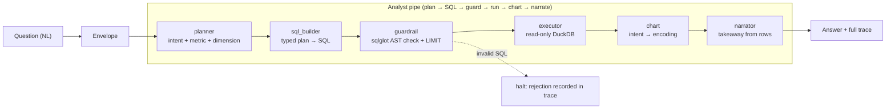

<div align="center">


</div>

# CopilotDesk — Natural-Language Analytics Copilot

**Ask a data question in plain English, get a governed answer you can trust.** CopilotDesk routes a question through a chain of small, single-purpose agents — plan it, write the SQL, prove the SQL is safe, run it, pick a chart, and write a takeaway grounded in the actual rows. Every stage is an independent *filter* over one immutable message, so the whole run leaves an audit trace and any stage can be tested, reordered, or swapped on its own.

<div align="center">

[](https://www.python.org/)
[](https://fastapi.tiangolo.com/)
[](https://pytest.org/)
[](https://opensource.org/licenses/MIT)

</div>

> **Portfolio project.** Built to demonstrate the Pipes & Filters architecture and a guard-railed text-to-SQL pipeline on a small synthetic warehouse. Not hardened for production use.

---

## The problem

"Text-to-SQL" demos are easy to build and hard to trust. A single model call turns a question into a query string, runs it, and prints a chart — but you can't see *why* it chose that query, you can't prove the SQL is read-only, and if the model narrates a conclusion the numbers don't support, nothing catches it.

CopilotDesk breaks that one opaque step into a line of small, honest ones. Each does a single job, hands its result to the next, and records what it did. The query is validated against a parsed AST before it ever touches the database, and the written takeaway is computed from the returned rows — never invented.

## What it does

Given a question like *"Top 5 categories by revenue"* it returns the SQL it ran, the rows, a recommended chart type, a one-line narrative, and a per-stage trace with timings:

```json
{
  "question": "Top 5 categories by revenue",
  "intent": "top_n",
  "sql": "SELECT category, ROUND(SUM(o.revenue), 2) AS revenue FROM ... LIMIT 5",
  "chart": "bar",
  "narrative": "Across 5 categorys, **electronics** leads on revenue ...",
  "data": [ ... ],
  "trace": [ {"agent": "planner", "duration_ms": 0.4, "output": ...}, ... ]
}
```

*Illustrative shape only — values come from the synthetic warehouse.*

## How it works

The pipeline is a **Pipes & Filters** architecture over a single **immutable typed envelope**. A question enters as an `Envelope`; each filter reads the payload keys upstream filters set, adds its own, and returns a *new* envelope. Filters never call each other and never know their position in the chain — which is exactly what makes the chain reorderable and each stage unit-testable on a hand-built envelope.



Two properties fall out of the immutable envelope for free:

- **The trace is a consequence of the run, not manual bookkeeping.** It can only grow, one entry per filter, in execution order. The published `/ask` response and the Streamlit UI both read it.
- **Failure is a value, not an exception.** When the guardrail rejects a query it sets an `error` and *halts* the envelope; every downstream filter waves a halted envelope through untouched, so the rejection still arrives at the caller carrying the full trace of what happened first. A filter that raises is caught, timed, and turned into the same kind of halt.

### The filter stages

| Stage | Job | How |
|---|---|---|
| `planner` | Route the question | Deterministic keyword heuristics → one of four intents (`kpi`, `breakdown`, `trend`, `top_n`) plus metric, dimension, grain |
| `sql_builder` | Compose the query | Maps the typed plan to a parameter-free `SELECT` over the star schema |
| `guardrail` | Prove it is safe | Parses with `sqlglot`; the **only** stage that can reject |
| `executor` | Run it | Executes on a **read-only** DuckDB connection, returns a row preview |
| `chart` | Recommend a visual | Fixed intent→encoding map (`trend`→line, `breakdown`/`top_n`→bar, `kpi`→metric) |
| `narrator` | Explain the result | Computes a takeaway **from the returned rows** — reports "no rows" rather than inventing |

## The guardrail

The guardrail is the reason the executor can assume it is only ever handed governed SQL. It parses the candidate query into a `sqlglot` AST and rejects anything that is not a single, read-only statement:

- exactly **one** statement (no stacked `SELECT 1; SELECT 2`);
- the root must be a `SELECT`;
- **no** `INSERT`, `UPDATE`, `DELETE`, `DROP`, `CREATE`, `ALTER`, or raw `Command` node anywhere in the tree;
- if the query has no `LIMIT`, one is injected (`row_limit`, default 1000 from `configs/config.yaml`).

Because validation walks the parsed tree rather than string-matching, it isn't fooled by keywords in comments or identifiers. A rejection is recorded as the guardrail's own trace entry *before* the pipe halts, so the audit trail always explains itself.

## Getting started

```bash
make install                              # uv sync --group dev
uv run python scripts/make_warehouse.py   # build the synthetic DuckDB warehouse + eval set

make api                                  # FastAPI on http://localhost:8480
make ui                                   # Streamlit UI on http://localhost:8981
```

The API needs the warehouse to exist: `/ask` and `/schema` return `503` until `make_warehouse.py` has run. Then try it:

```bash
curl -s localhost:8480/ask -H 'content-type: application/json' \
  -d '{"question": "Show revenue by region"}'
```

Or drive the pipeline directly in Python:

```python
from copilotdesk.pipeline import build_analyst_pipeline, as_answer

analyst = build_analyst_pipeline()
answer = as_answer(analyst("What is the revenue trend over time?"))
print(answer["sql"], answer["narrative"])
```

Adding a stage is a one-line change and touches nothing else:

```python
from copilotdesk.pipeline import build_analyst_pipeline, NarratorFilter

pipe = build_analyst_pipeline().then(MyAuditFilter())   # append
# or compose(PlannerFilter(), SqlBuilderFilter(), ...) to reorder from scratch
```

## API

| Method | Route | Purpose |
|---|---|---|
| `GET` | `/health` | Liveness check |
| `GET` | `/schema` | Tables and columns in the warehouse |
| `POST` | `/ask` | Run the full pipeline for one question; returns SQL, data, chart, narrative, and trace |
| `GET` | `/report` | Latest evaluation metrics + per-question results |

`/ask` returns `422` when the pipeline halts (e.g. the guardrail rejects the generated SQL), with the halting reason in the detail.

## Evaluation

The warehouse is synthetic (`scripts/make_warehouse.py` seeds a DuckDB star schema — `dim_customers`, `dim_products`, `fact_orders` — with a fixed RNG seed), and it ships with a small **labeled question set**: each question carries the intent the planner *should* route it to. That gives a ground truth to measure against. `copilotdesk.agents.evaluate` runs every question through the real pipeline once and reads the measurements off the resulting envelope:

- **intent accuracy** — planner routing vs. the labeled intent
- **guardrail pass rate** — fraction whose generated SQL validated
- **execution rate** — fraction that produced rows end-to-end

To reproduce (writes `report.pkl` for `/report` and logs to MLflow):

```bash
uv run python -m copilotdesk.agents.evaluate
make mlflow          # optional: browse runs at http://localhost:5049
```

Numbers are omitted here because they depend on the generated dataset and seed. The test suite asserts intent accuracy ≥ 0.9 and a 100% guardrail/execution rate on the bundled question set; run the script to produce the exact figures for your configuration.

## Testing

```bash
make test            # uv run pytest --cov
```

`tests/test_copilotdesk.py` covers the pattern's guarantees, not just outputs:

- envelope immutability — derivations never mutate the source; payload rejects in-place edits
- each filter in isolation on a hand-built envelope (planner routing, SQL shaping, guardrail rejection, chart mapping)
- structural behaviour — halt propagation, exception containment, and pipeline reorder/extend
- end-to-end answers and the `/health`, `/schema`, `/ask`, `/report` HTTP contract

## Limitations

- The planner is deterministic keyword routing, not an LLM — it handles the demo's question vocabulary (revenue/orders/AOV by region/category/segment) and falls back to a KPI intent otherwise.
- The SQL builder targets one fixed star schema; new metrics or dimensions mean extending its mappings.
- The guardrail enforces *read-only, single-SELECT, LIMIT-bounded* SQL — it is a safety boundary against writes and injection shape, not a full query cost or row-privacy policy.
- All data is synthetic; thresholds and the question set would need rework against a real warehouse.

## Project structure

```
src/copilotdesk/
├── pipeline/     # Pipes & Filters core: Envelope, filters, runner, /ask projection
├── agents/       # Stage logic the filters delegate to: planner, sqlbuilder, evaluate
├── api/          # FastAPI app (main:app) and routes
├── ui/           # Streamlit demo (ask, eval report, schema tabs)
└── settings.py   # env + configs/config.yaml loading
scripts/
└── make_warehouse.py   # builds the synthetic DuckDB warehouse + labeled question set
```

## License

MIT

---

<div align="center">

**Jackson Marcus** · Senior AI & Machine Learning Engineer

[](https://github.com/jackson-marcus)
[](mailto:wajahatanees41@gmail.com)

</div>
